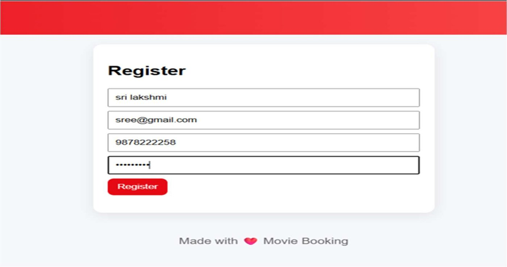
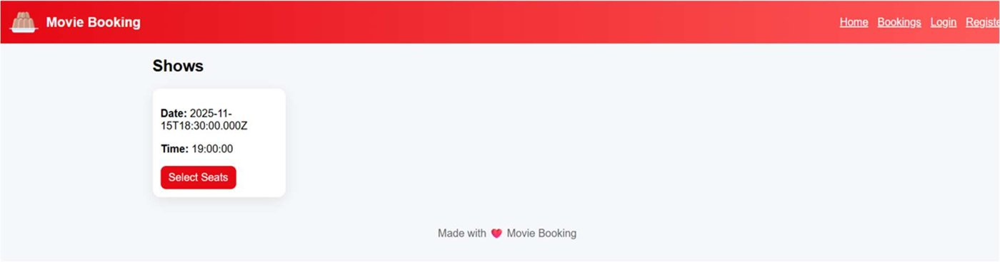
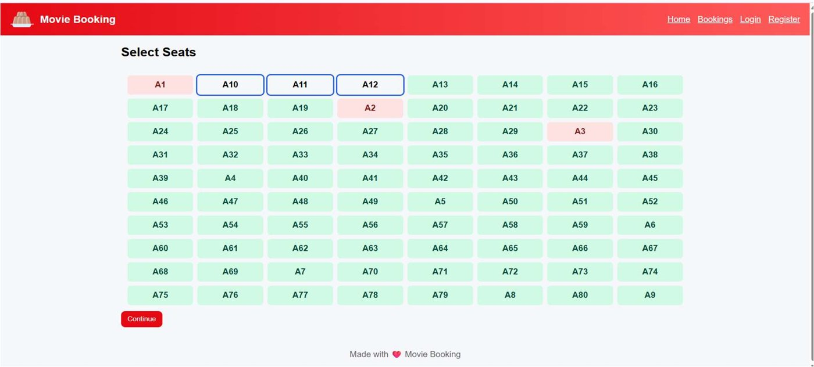
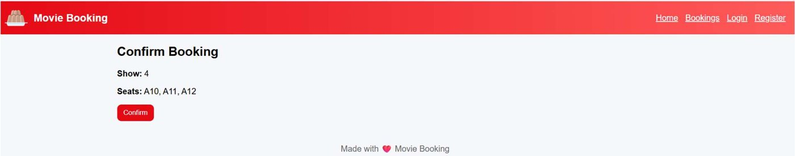
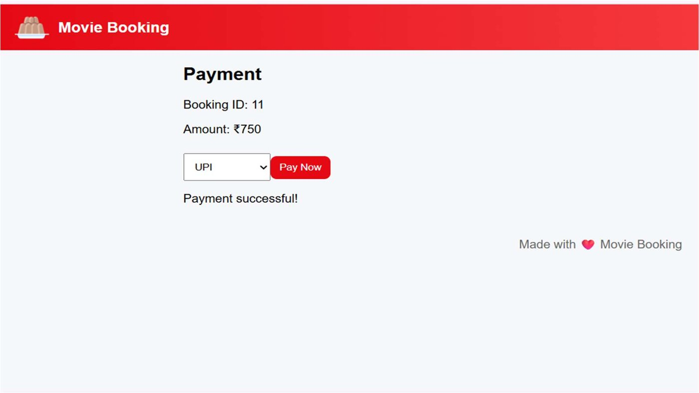
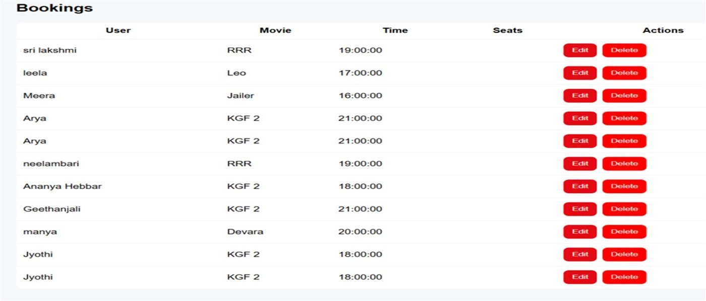
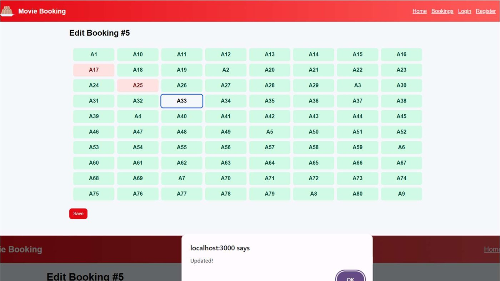
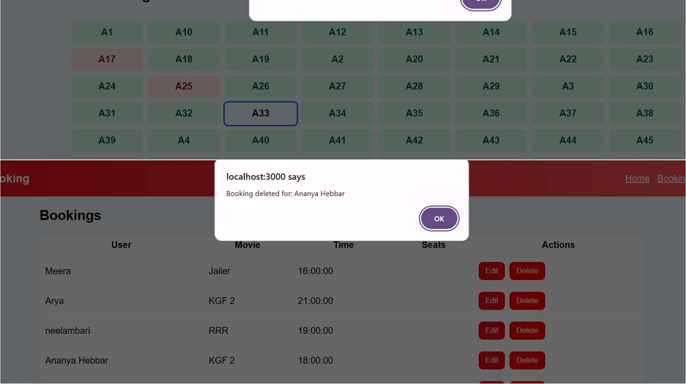
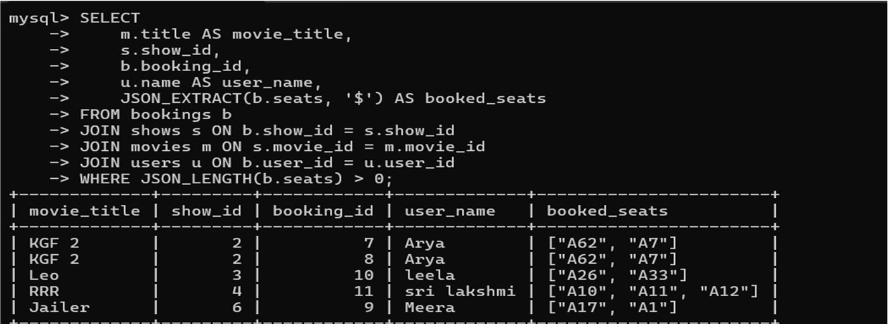
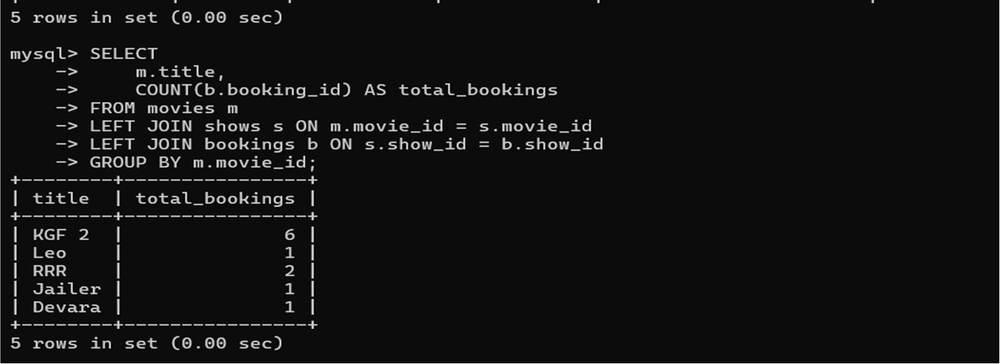

# 🎬 Movie Ticket Booking System (React + Node.js + MySQL)


A database-driven movie ticket booking app. Users register and log in, browse movies, pick a show, choose seats on a live seat map, confirm the booking, pay, and manage (edit / delete) their bookings. Built as a **DBMS Mini Project** at Mangalore Institute of Technology & Engineering (Dept. of CSE).

---

## ✨ Features

- 🔐 User registration and login (passwords hashed with **bcrypt**)
- 🎥 Movie listing fetched from MySQL
- 🕒 Show timings for each movie
- 💺 Interactive seat grid: available, booked and selected seats
- ✅ Booking confirmation page and simulated payment (UPI / card etc.)
- 📋 Bookings list built with SQL `JOIN`s across users, shows and movies
- ✏️ Edit seats of a booking and 🗑️ delete a booking, with popup feedback
- 🧾 Booking flow: **Home → Movie → Shows → Seats → Confirm → Pay**

## 🧰 Tech Stack

| Layer    | Technology                                   |
| -------- | -------------------------------------------- |
| Frontend | React 19, React Router, Axios (Create React App) |
| Backend  | Node.js, Express.js, mysql2, bcryptjs, CORS, dotenv |
| Database | MySQL 8 (relational schema with primary/foreign keys) |

## 🏗️ Architecture

```
React (Frontend :3000)  →  Express REST API (:5001)  →  MySQL (movie_booking)
React (UI)              ←  JSON responses            ←  Stored data
```

## 📸 Screenshots

**Register**


**Show timings**


**Seat selection**


**Confirm booking**


**Payment**


**My bookings (Edit / Delete)**


**Edit booking**


**Delete booking confirmation**


**SQL verification: JOIN with booked seats**


**SQL verification: bookings per movie**


## 📁 Project Structure

```
<repo-name>/
├── README.md                       # (this file)
└── movie-ticket-booking-system/
    ├── README.md
    ├── LICENSE
    ├── .gitignore
    ├── backend/
    │   ├── server.js                 # Express app, mounts all routes
    │   ├── db.js                     # MySQL connection pool
    │   ├── routes/
    │   │   ├── auth.js               # POST /register, /login
    │   │   ├── movies.js             # GET /
    │   │   ├── shows.js              # GET /?movie_id=
    │   │   ├── seats.js              # GET /?show_id=, PUT /mark
    │   │   ├── bookings.js           # GET, POST, PUT, DELETE
    │   │   └── payments.js           # POST /
    │   ├── package.json
    │   └── .env.example              # Copy to .env and add your MySQL password
    ├── frontend/
    │   ├── public/
    │   ├── src/                      # App.js holds all pages and routes
    │   └── package.json
    ├── database/
    │   ├── app_schema.sql            # ✅ Schema + sample data used by this app
    │   └── movie_schema.sql          # Earlier DBMS-report dump (reference only)
    └── docs/
        ├── DBMS_Mini_Project_Report.pdf
        ├── SQL_Part.pdf
        └── images/                   # Screenshots used in this README
```

## 🚀 Getting Started

### Prerequisites

- [Node.js](https://nodejs.org/) 18+
- [MySQL](https://dev.mysql.com/downloads/) 8 (MySQL Workbench or the command line)

### 1. Clone the repository

```bash
git clone https://github.com/<your-username>/<repo-name>.git
cd <repo-name>/movie-ticket-booking-system
```

### 2. Create the database

This creates the `movie_booking` database, all tables, 5 movies, 6 shows and 80 seats per show:

```bash
mysql -u root -p < database/app_schema.sql
```

(or open `database/app_schema.sql` in MySQL Workbench and run it)

### 3. Start the backend

```bash
cd backend
npm install
```

Create `backend/.env` (copy `.env.example`) and set your MySQL password:

```env
DB_HOST=localhost
DB_USER=root
DB_PASSWORD=your_mysql_password
DB_NAME=movie_booking
DB_PORT=3306
PORT=5001
```

> 🔐 Never commit `.env`. It is already listed in `.gitignore`.

```bash
npm run dev      # nodemon, or: npm start
```

You should see `Backend running on port 5001`.

### 4. Start the frontend

In a second terminal:

```bash
cd frontend
npm install
npm start
```

Open **http://localhost:3000**, register a new account, and book a ticket.

> The frontend calls the API at `http://localhost:5001/api` (set in `frontend/src/App.js`).

## 🔌 API Endpoints

Base URL: `http://localhost:5001/api`

| Method | Endpoint              | Description                          |
| ------ | --------------------- | ------------------------------------ |
| POST   | `/auth/register`      | Create a user (bcrypt-hashed password) |
| POST   | `/auth/login`         | Log in with email and password       |
| GET    | `/movies`             | List all movies                      |
| GET    | `/shows?movie_id=1`   | Shows for a movie                    |
| GET    | `/seats?show_id=1`    | Seat map for a show                  |
| PUT    | `/seats/mark`         | Mark seats as booked                 |
| GET    | `/bookings`           | All bookings (user + movie + show JOIN) |
| GET    | `/bookings/:id`       | One booking                          |
| POST   | `/bookings`           | Create a booking (`user_id`, `show_id`, `seats[]`) |
| PUT    | `/bookings/:id`       | Update the seats of a booking        |
| DELETE | `/bookings/:id`       | Delete a booking (and its payment)   |
| POST   | `/payments`           | Record a payment for a booking       |

## 🗃️ Database Design

| Table      | Purpose / key columns                                           |
| ---------- | --------------------------------------------------------------- |
| `users`    | `user_id`, `name`, `email` (unique), `phone`, `password` (hash)  |
| `movies`   | `movie_id`, `title`, `genre`, `rating`, `duration`               |
| `shows`    | `show_id`, `movie_id` (FK), `show_date`, `show_time`             |
| `seats`    | `seat_id`, `show_id` (FK), `seat_number`, `status`; unique per show |
| `bookings` | `booking_id`, `user_id` (FK), `show_id` (FK), `seats` (JSON text) |
| `payments` | `payment_id`, `booking_id` (FK), `amount`, `payment_mode`        |

Example report query (booked seats per booking):

```sql
SELECT m.title, s.show_id, b.booking_id, u.name AS user_name,
       JSON_EXTRACT(b.seats, '$') AS booked_seats
FROM bookings b
JOIN shows  s ON b.show_id  = s.show_id
JOIN movies m ON s.movie_id = m.movie_id
JOIN users  u ON b.user_id  = u.user_id;
```

## 📄 Reports

- [`docs/DBMS_Mini_Project_Report.pdf`](movie-ticket-booking-system/docs/DBMS_Mini_Project_Report.pdf): full project report
- [`docs/SQL_Part.pdf`](movie-ticket-booking-system/docs/SQL_Part.pdf): SQL queries and outputs

> `database/movie_schema.sql` is the schema dump used while writing the report (table names such as `booking`, `showtable`). The running app uses `database/app_schema.sql`.

## ⚠️ Known Limitations

- Seats are marked booked, but deleting or editing a booking does **not** free them again.
- Double-booking is blocked in the seat-map UI only; the API does not re-check seat availability or use a transaction.
- Payment is simulated (no real gateway) and ticket price is fixed at ₹250 per seat in the frontend.
- No JWT/session handling: the logged-in user is kept on the client.
- Movie posters load from external image URLs, so they need internet access.

## 🔮 Future Improvements

- Free seats on delete/edit and wrap booking in an SQL transaction
- QR-code tickets, admin dashboard, real payment gateway
- JWT authentication and role-based access

## 👩‍💻 Author

**Ananya Hebbar** · Department of Computer Science & Engineering, Mangalore Institute of Technology & Engineering

## 📜 License

Released under the [MIT License](LICENSE).
